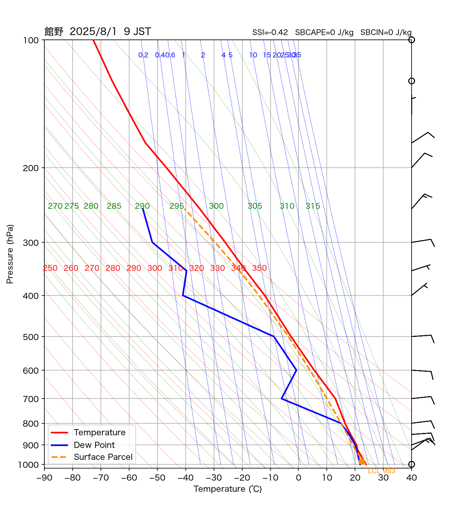
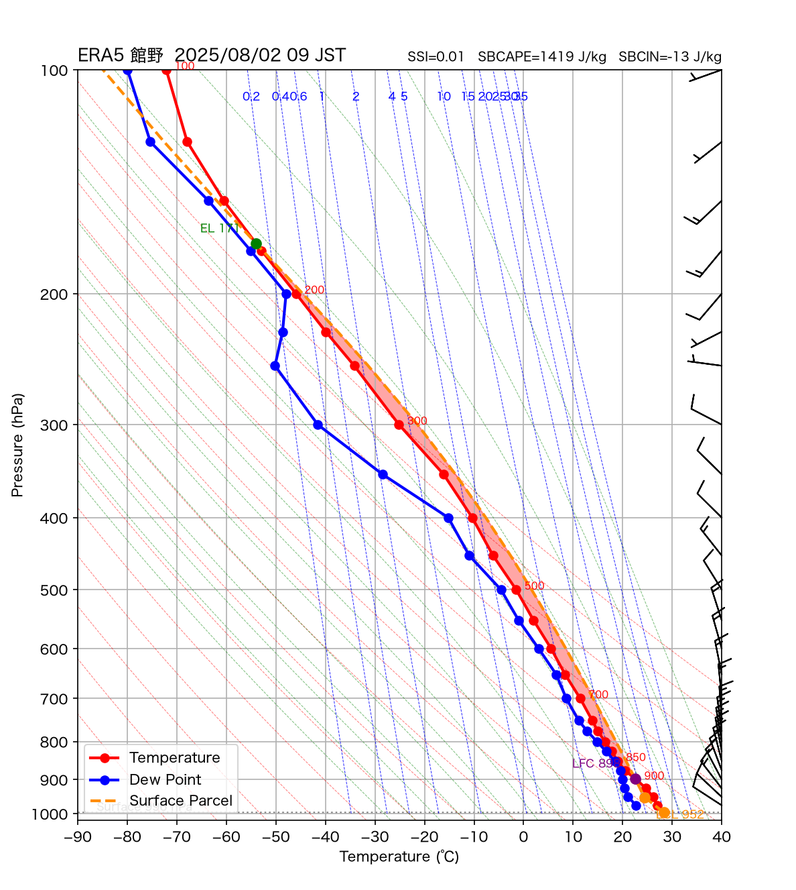

# Atmos Profile Analyzer for Radiosonde and ERA5

An interactive weather sounding analysis tool for **radiosonde observations** and **ERA5 reanalysis**.

Atmos Profile Analyzer is a Python and Streamlit application for visualizing atmospheric vertical profiles on an emagram (Skew-T Log-P style) and calculating thermodynamic indices used in weather analysis and forecasting.





---

## Features

### Radiosonde Analysis (Japan Meteorological Agency)

- Retrieve upper-air observations from the Japan Meteorological Agency (JMA)
- Plot atmospheric profiles on an emagram
- Calculate:
  - Showalter Stability Index (SSI)
  - Surface-Based CAPE (SBCAPE)
  - Surface-Based CIN (SBCIN)
  - LCL (Lifted Condensation Level)
  - LFC (Level of Free Convection)
  - EL (Equilibrium Level)

---

### ERA5 Reanalysis (Copernicus C3S)

- Download ERA5 pressure-level and surface data
- Automatic nearest-grid selection
- Automatic surface-pressure correction
- Automatic removal of underground pressure levels
- Plot emagrams
- Calculate:
  - SSI
  - SBCAPE
  - SBCIN
  - LCL
  - LFC
  - EL

---

## Screenshots

### Radiosonde Mode

*(Add screenshot here)*

### ERA5 Mode

*(Add screenshot here)*

---

## Installation

Clone this repository.

```bash
git clone https://github.com/taku284730/atmos-profile-analyzer.git

cd atmos-profile-analyzer
```

Install the required packages.

```bash
pip install -r requirements.txt
```

---

## Run

```bash
streamlit run app.py
```

---

## Requirements

- Python 3.11+
- Streamlit
- NumPy
- Pandas
- Matplotlib
- MetPy
- Xarray
- cfgrib
- cdsapi

---

## Data Sources

### Radiosonde

Japan Meteorological Agency (JMA)

https://www.data.jma.go.jp/

### ERA5

This application uses ERA5 reanalysis data provided by the Copernicus Climate Change Service (C3S).

Generated using Copernicus Climate Change Service information.

https://cds.climate.copernicus.eu/

---

## Roadmap

Current features

- ✅ Radiosonde analysis
- ✅ ERA5 analysis
- ✅ SSI calculation
- ✅ CAPE / CIN calculation
- ✅ Interactive Streamlit interface

Planned features

- ⬜ Radiosonde vs ERA5 comparison
- ⬜ GFS support
- ⬜ MSM support
- ⬜ Time-series analysis
- ⬜ Animation support

---

## License

MIT License

---

## Author

Takuro Odagawa

Science Teacher (Japan)

Interested in atmospheric science, weather forecasting, and science education.